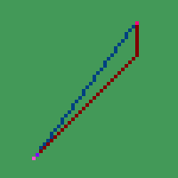

# travelers-bresenhamLineAlgorithm
adapted bresenham's line algorithm for the game https://thetravelers.online/

https://en.wikipedia.org/wiki/Bresenham's_line_algorithm

using bresenham's line algorithm only changes the path of movement, it does not effect the distance required to get to a location.

# Usage:
copy and paste the bresBOT object into your existing bot script,

bresBOT.run(currentx, currenty, targetx, targety);
returns the direction to travel,

use bresBOT.run(currentx, currenty, targetx, targety); everytime you want to move,

will automatically reset when it receives coordinates for a different destination
```js
bresBOT.run(-3000, -4000, 0, 0);
```
> Note: this is only setup to run with a singular bot.

# Setting:
```js
bresBOT.limit = 120;
````
after moving 120 times it will reset in help account for offset caused by double stepping, change it to suit your needs.

# Example Image

